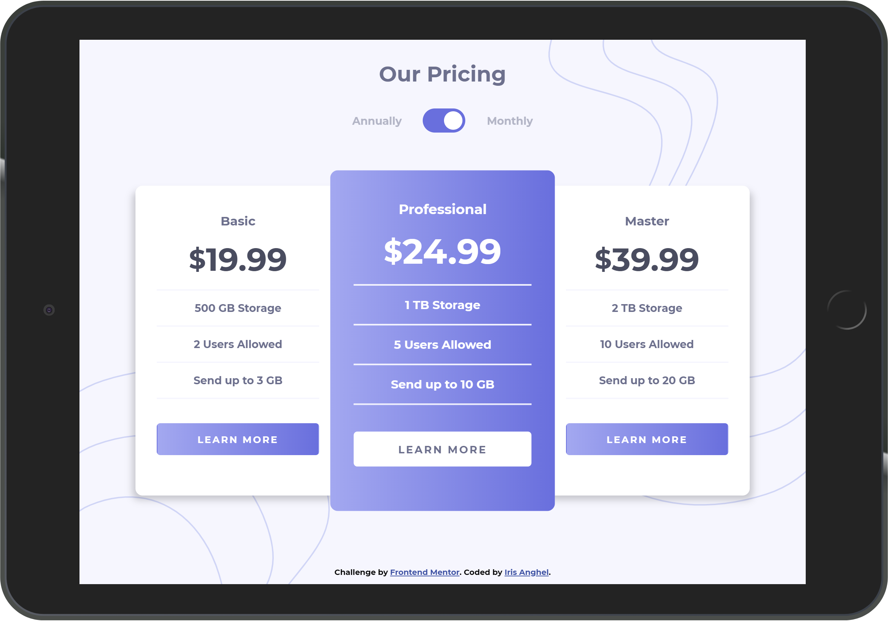

# Frontend Mentor - Pricing component with toggle

[Frontend Mentor](https://www.frontendmentor.io) challenges allow you to improve your skills in a real-life workflow.
Your challenge is to build out this pricing component and get it looking as close to the design as possible.
You can use any tools you like to help you complete the challenge.

**To do this challenge, you need a basic understanding of HTML, CSS and JavaScript.**

[Live Preview](https://iris-anghel.github.io/Frontendmentor-Pricing-component-with-toggle/)

